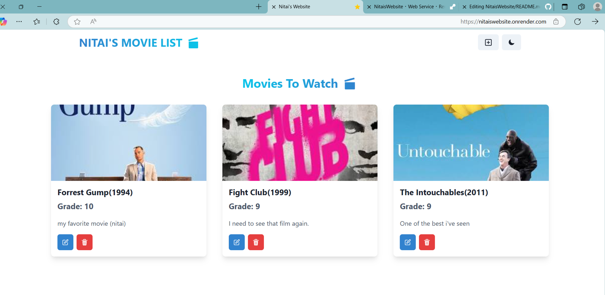

# Nitai's Movie Watchlist 🎬⭐

Welcome to Nitai's Movie Watchlist: a full-stack web application where you can save, update, and manage your favorite movies, add your personal rating (1-10), and even leave a personal note!

---

## 🚀 Live Website

🌐 [Visit the site here](https://nitaiswebsite.onrender.com)

---

## Project Description

This project is a full-stack application built with:

- **Frontend**: React + Vite + Chakra UI
- **Backend**: Express.js + Node.js
- **Database**: MongoDB Atlas (with Mongoose)

Users can:
- Add new movies (title, release year, poster image)
- Rate movies (1-10)
- Leave personal notes
- Update or delete saved movies
- Enjoy a fast, responsive UI

---

## Tech Stack

| Frontend | Backend | Database | Other |
|----------|---------|----------|-------|
| React + Vite | Express.js | MongoDB Atlas | Chakra UI |
| Zustand (global state) | Node.js | | Render Deployment |

---

## 📂 Project Structure

```
/frontend
    /public
        favicon.png
    /src
        /components
            Navbar.jsx
            MovieCard.jsx
        /pages
            CreatePage.jsx
            HomePage.jsx
        /store
            movie.js
    main.jsx
/backend
    /controllers
        movie.controller.js
    /models
        movie.model.js
    /routes
        movie.route.js
    server.js
.env
package.json
```

---

## 📦 Installation and Running Locally

### 1. Clone the Repository

```bash
git clone https://github.com/NitaiEdelberg/NitaisWebsite.git
cd NitaisWebsite
```

---

### 2. Setup Environment Variables

Create a `.env` file in the root:

```bash
MONGO_URI=your-mongodb-connection-string
PORT=5000
```

 `.env` is already included in `.gitignore`.

---

### 3. Install Dependencies

```bash
npm install
npm install --prefix frontend
```

---

### 4. Run Development Server

Start backend:

```bash
npm run dev
```

Start frontend:

```bash
npm run dev --prefix frontend
```

---

## 🚀 Building for Production

To build the frontend:

```bash
npm run build --prefix frontend
```

To run the backend in production:

```bash
npm run start
```

---

## API Endpoints

All API endpoints are prefixed with `/api/movies`

| Method | Endpoint | Description |
|--------|----------|-------------|
| GET | `/api/movies` | Fetch all movies |
| POST | `/api/movies` | Create a new movie |
| PUT | `/api/movies/:id` | Update a movie (title, release year, image, grade, note) |
| DELETE | `/api/movies/:id` | Delete a movie |

### Example payload for POST / PUT:

```json
{
  "name": "Inception",
  "year": 2010,
  "image": "https://image-url.com/inception.jpg",
  "grade": 9,
  "note": "Mind-blowing sci-fi thriller!"
}
```

 All fields are required except `grade` and `note` (they are optional).

---

## Future Improvements

- Authentication system (users login/signup)
- Public sharing of movie lists
- Star filtering (e.g., show only 8+ rated movies)
- Upload real image files instead of URL
- Better mobile UI

---

## 📸 Screenshot



---

## 💬 Contact

Made by [Nitai Edelberg](https://github.com/NitaiEdelberg)

---

## Acknowledgements

- [Chakra UI](https://chakra-ui.com/)
- [MongoDB Atlas](https://www.mongodb.com/cloud/atlas)
- [Render.com](https://render.com/)
- [Icons8 Star Icon](https://icons8.com/icons/set/star)

